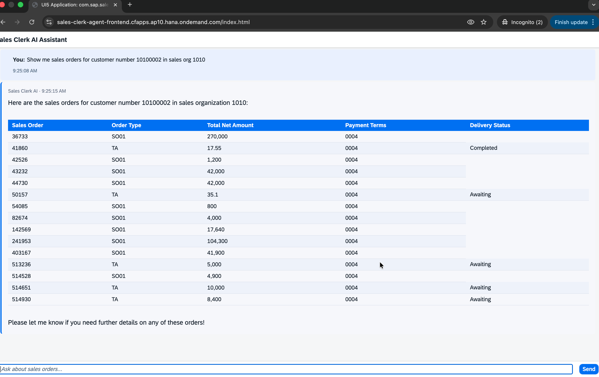

# Sales Clerk AI Assistant — End User Guide

## Overview

**Sales Clerk AI Assistant** is a conversational AI tool that lets you manage SAP S/4HANA sales orders using plain English. Instead of navigating SAP menus and transaction codes, you simply type what you want — and the assistant takes care of the rest.

Whether you need to look up an order, create a new one, adjust quantities, or update payment terms, you can do it all through a simple chat interface in your web browser.

---

## How It Works

```
You type a question or request
        │
        ▼
┌───────────────────────┐
│   Chat Interface      │  ← Web browser (SAPUI5)
│  (your browser)       │
└──────────┬────────────┘
           │ your message
           ▼
┌───────────────────────┐
│   AI Agent            │  ← Understands your intent
│   (GPT-4o via         │     Decides which SAP action to take
│    SAP AI Core)       │     Remembers your conversation
└──────────┬────────────┘
           │ reads / writes data
           ▼
┌───────────────────────┐
│   SAP S/4HANA         │  ← Your live sales order data
│   Sales Orders API    │
└───────────────────────┘
```

**Your conversation is remembered** within each session — you can ask follow-up questions like *"show me the details of the third one"* and the assistant will understand what you mean.

---

## Accessing the Application

1. Open your browser and go to the URL provided by your administrator
2. You will be redirected to the **company login page** — sign in with your usual corporate credentials
3. After login you will see the **Sales Clerk AI Assistant** chat screen

> **Note:** You need a valid company account. Contact your IT administrator if you cannot log in.

---

## The Chat Interface

After login you will see a chat screen. Type your question in the input box at the bottom and press **Send** (or hit Enter). The assistant responds with formatted results — including tables when listing multiple orders.



*Example: asking for all sales orders for a customer returns a formatted table with order numbers, types, amounts, payment terms, and delivery status.*

---

## What You Can Do

### 1. List Sales Orders

Search for orders by customer or sales organization. The assistant returns up to 20 orders at a time.

| Example questions |
|---|
| Show me all sales orders for customer 10100002 |
| List orders in sales organization 1710 |
| Show orders for customer 10100001 in sales org 1010 |

---

### 2. View Order Details

Get full details of a specific order, including all line items.

| Example questions |
|---|
| Show me the details of order 36733 |
| What are the line items in sales order 41860? |
| Get order 514930 with all items |

The detail view includes: order type, customer, sales organization, total amount, delivery status, payment terms, and each product line with quantities and delivery dates.

---

### 3. Create a Sales Order

Ask the assistant to create an order. It will ask you for any missing information before creating.

| Example requests |
|---|
| Create a standard order for customer 10100001 in sales org 1710 for 5 units of product TG11 |
| I need a new sales order — order type OR, customer 10100002 |

**Required information the assistant will ask for if not provided:**
- Order type (e.g. `OR` for standard order)
- Sales organization (e.g. `1710`)
- Distribution channel (e.g. `10`)
- Division (e.g. `00`)
- Customer number (sold-to party)
- At least one product with a quantity

> **The assistant will always confirm before creating an order.**

---

### 4. Update an Order Item

Change the quantity or requested delivery date of a line item.

| Example requests |
|---|
| Update order 36733 item 10 — change quantity to 8 |
| Set the delivery date for order 41860 line 10 to June 30 2025 |
| Change item 000020 of order 514930 to 3 EA |

---

### 5. Update Order Header

Change payment terms on an existing order.

| Example requests |
|---|
| Update order 36733 payment terms to NT30 |
| Change the payment terms on order 82674 to 0001 |

---

### 6. Delete a Sales Order

Remove an order that is no longer needed.

| Example requests |
|---|
| Delete sales order 514930 |
| Remove order 41860 |

> **Important:** The assistant will always ask you to confirm before deleting. Deletion cannot be undone. Only orders that have **not yet been delivered or billed** can be deleted.

---

## Tips for Best Results

**Be specific about order numbers**
The assistant works best when you provide exact sales order numbers. If you don't know the number, ask it to list orders for your customer first.

**Use customer numbers, not names**
SAP identifies customers by number (called "sold-to party"). If you only know the customer name, ask your administrator for the customer number.

> *"What's the customer number for ACME Corp?"* — the assistant cannot look this up, but can help once you have it.

**Ask follow-up questions**
Your conversation history is kept throughout the session. You can refer back naturally:
- *"Show me orders for customer 10100002"*
- *"Open the second one"*
- *"Update item 10 — change the quantity to 5"*

**Common SAP terms**

| Term | What it means |
|---|---|
| Sold-to party | The customer who placed the order (customer number) |
| Sales organization | The unit responsible for the sale (e.g. 1710) |
| Distribution channel | How the goods are delivered to the customer (e.g. 10) |
| Division | The product group or line (e.g. 00) |
| Payment terms | When payment is due (e.g. NT30 = net 30 days, 0001 = immediate) |
| Delivery status | Whether the order has been shipped (A = not started, C = complete) |

---

## Frequently Asked Questions

**The assistant says it can't find a customer. What should I do?**
Make sure you are using the numeric customer number (sold-to party), not the customer name. Example: `10100001` not `ACME Corp`.

**Can I see orders from previous sessions?**
No — conversation memory resets each time you open a new browser tab or reload the page. The order data in SAP is always up to date, but you will need to re-ask your questions.

**The assistant is slow to respond. Is that normal?**
Yes, for complex requests it may take a few seconds while it queries SAP. A response typically arrives within 5–10 seconds.

**I got an error message. What should I do?**
The assistant will describe the error and suggest next steps. Common causes:
- The order number does not exist
- The order is already delivered or billed (cannot be changed or deleted)
- You do not have permission to perform the action in SAP

If the problem continues, contact your SAP administrator.

**Can the assistant do things I am not allowed to do in SAP?**
No. All actions go through your SAP user account and respect your existing SAP authorizations.

---

## Getting Help

If you experience issues, contact your IT support team and provide:
- The URL of the application
- What you typed and what response you received
- The approximate time of the issue
